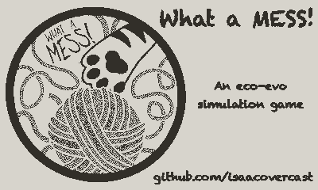

# What A MESS!

A playful gamified interpretation of the [MESS](https://github.com/messDiv/MESS)  model.

Controls:
* **L/R** - Change Migration Rate
* **U/D** - Change Community Assembly Dynamics
* **A** - Run one step of the model
* **B** - Toggle autoplay

Access the Menu to change Ecological Strength.

## Dev Notes

# Building the game
`pdc src build`

* [A useful tutorial video on building a playdate game](https://www.youtube.com/watch?v=UZ04rk3lLqU)
## Assets

* [1-bit Beauties](https://keenmustdie.itch.io/1-bit-beauties)
* [Fantasy game asset pack](https://boldoboldin.itch.io/assets-for-fantasy-games-asset-pack)
* [Dungeon tiles](https://enui.itch.io/bitsy-dungeon-tiles)

Importing and ditherting and brightness/exposure tuning for MESS logo splash screen
* [PlayDither](https://potch.me/demos/playdither/)

I loaded all species icons into an ImageTable, while
leaving the first image as a blank tile. Create a blank 16x16 png like this:

`magick -size 16x16 xc:none transparent_image.png`

## License
This project is licensed under the Unlicense - see the [LICENSE](LICENSE) file for details.

